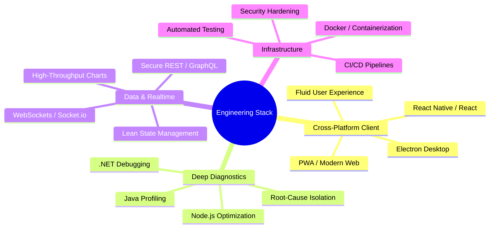

  # Masoud Soroush 
  

  
  
  

--- 
## PROFILE
Software Engineer experienced in End-to-end development Web and mobile applications. I built user-friendly interfaces using React, Next.js and React-Native with TypeScript. Strong background in responsive design, visualization charts, real-time data streaming, and performance optimization. with a focus on security, accessibility, development, backed by robust Node.js, event-driven systems. 

| Delivery Handlers | Strategic Core | Architectural Solutions |
| :--- | :--- | :--- |
| 🛠️ **System Engineering** • Architecting multi-platform codebases • Rebuilding legacy layers for scale • Hardening Web/App cryptography • Isolating obscure runtime system errors • Standardizing unified CI/CD pipelines | 🎯 **Execution Strengths** • Deep-dive Client Side Architecture • Full Autonomy from Design to Prod • Rapid Problem Reverse-Engineering • High-Throughput UI Stream Renders • Systems Performance Engineering | ⚡ **Problem Domains Solved** • High-risk platform migrations • Scaling real-time synchronization streams • Standardizing chaotic build flows • Refactoring non-performing layout engines • Shipping secure corporate applications |
<!--
  GitHub Profile README for @soroushm
  Repository name must match exactly: soroushm/README.md
-->

---

## 📈 Stats Console

  
  
  

## STACK

---
## Career progression map:

---
`SYSTEM_STATUS: OPEN_FOR_INNOVATION`
### 🤝 Let's Connect 

  
  

*"I take full ownership of the development cycle—from the first pixel to the final deployment."*
